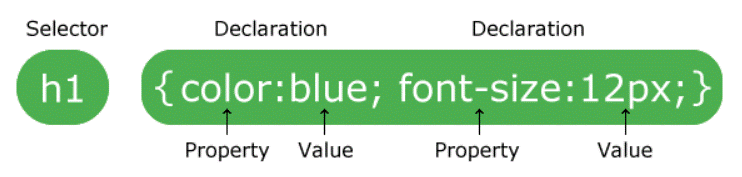

# Básico da Linguagem

## Comentários
`/* comentário */`

## Sintaxe
  

## Possíbilidades
* Estilização
* Animação
* Variáveis
* Funções

## Modelos
* Box Model     (caixinhas)
* Grid Layout   (Grade)
* Flex Box      (Eixos)

## FrameWork
- Bootstrap
- Materialize CSS

## Pré Processadores
Nível acima de abstração.