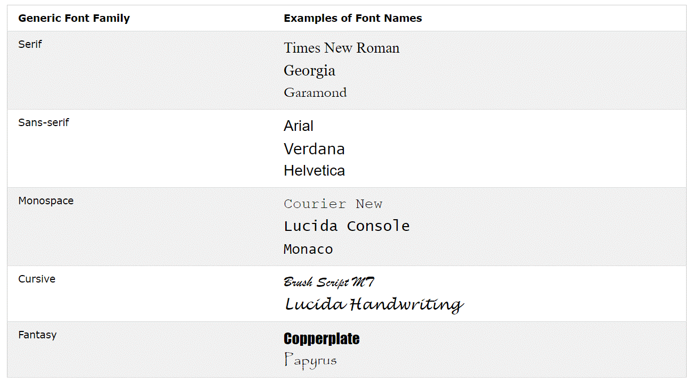
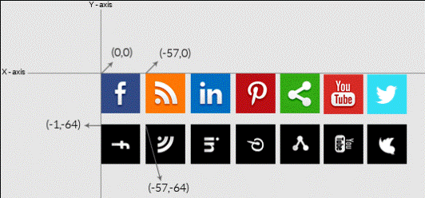

# TEXTO

## color 

* Segundo o W3C se você define uma a propriedade `color` também deve definir `background-color`.

## Alinhamento

* **text-align** - Alinhamento horizontal.
  * Valores possíveis: `left aligned` - `right aligned` - `centered` - `justified`
* **direction: rtl; unicode-bidi: bidi-override;** - inverte a ordem do texto → otxet od medro a etrevni
* **vertical-align** - Alinhamento vertical.
  * Valores possíveis: `top` - `middle` - `bottom`

## text-decoration

* A linha do texto
* Valores possíveis: `none` - `underline` - `line-through` - `overline`

## text-transform

* Altura da caixa do texto
* Valores possíveis: `uppercase` - `lowercase` - `capitalize`(Primeira letra de cada palavra maiúscula)

## Espaçamento

* **text-indent** - Recuo inicial de paragrafo.
* **letter-spacing** - Espaço entre cada letra.
* **line-height** - Espaço entre as linhas.
* **word-spacing** - Espaço entre cada palavra.
* **white-space: nowrap;** - Para manter o texto em uma mesma linha apesar de uma quebra de linha (enter).

## text-shadow

`text-shadow: 2px 2px;`
* Sobra do texto
* Propriedade Conjugada
  * Deslocamento horizontal
  * Deslocamento vertical
  * Efeito de desfoque (em px) (Pode ser desconsiderado)
  * Cor da sombra

# FONTE

## Propriedades Conjugadas
`font: italic small-caps bold 12px/30px Georgia, serif;`

* font-style
* font-variant
* font-weight
* font-size/line-height   (requerido)
* font-family (requerido)

## Fontes Padrões do CSS



## font-family
`font-family: "Times New Roman", Times, serif;`
* Pode se colocar mais de uma fonte para garantir compatibilidade com o navegador, são separadas por, e fontes com nomes compostos devem estar entre aspas.

* Safe fonts (Praticamente Universais)
  * Arial (sans-serif)
  * Verdana (sans-serif)
  * Helvetica (sans-serif)
  * Tahoma (sans-serif)
  * Trebuchet MS (sans-serif)
  * Times New Roman (serif)
  * Georgia (serif)
  * Garamond (serif)
  * Courier New (monospace)
  * Brush Script MT (cursive)

## Estilo

* **font-style** - Valores possíveis: `normal` - `italic` - `oblique`(similar ao itálico)
* **font-weight** - Valores possíveis: `normal` - `bold`
* **font-variant** - Estilização letras maiúscula e pequenas, Valores possíveis: `normal` - `small-caps`

## font-size
`font-size: 2.5em; /* 40px/16=2.5em */` 
  * Determina o tamanho da fonte, que por padrão é **16px = 1em = 12pt**, ao usar deixa o site mais acessível.  

  * Para garantir compatibilidade definir `body { font-size: 100%; }` e usar 'em'.

  * `vw` (viewport width) deixa o texto sujeito à largura da janela, **1vw = 1%** da largura da janela.

  ## Google Fontes

* Adicionar fonte, basta adicionar um link no html:
  ```html 
  <link rel="stylesheet" href="https://fonts.googleapis.com/css?family=Audiowide|Sofia|Trirong">
  ```
  (Aqui importamos três fontes, muitas fontes podem deixar o carregamento do site lento).

* Depois só adicionar ao elemento. `h1.a {font-family: "Audiowide", sans-serif;}` (sans-serif é fallback, alternativa).

* Usar uma fonte com efeito, basta importar:
  ```html
  <link rel="stylesheet" href="https://fonts.googleapis.com/css?family=Sofia&effect=fire">
  ```

* Colocar a seguinte classe aos elementos que conterão essa fonte
`<h1 class="font-effect-fire">`.

* Continua possível editar a fonte no CSS.

* Também é possível adicionar mais de um efeito.
  ```html
  <link rel="stylesheet" href="https://fonts.googleapis.com/css?family=Sofia&effect=neon|outline|emboss|shadow-multiple">
  ```

* Importar diretamente do CSS
```css
  @import url('https://fonts.googleapis.com/css?family=Raleway');
```

## Fontes Locais

```css
  @font-face {
    font-family: 'FonteLogo';
    src: url("../_fonts/bubblegum-sans-regular.otf");
  }  
```

## Carácter

Definir o tipo de carácter - `@charset "UTF-8";`.

# ÍCONE

* Para adicionar basta adicionar o seguinte link na head do HTML.

  `<link rel="stylesheet" href="https://fonts.googleapis.com/icon?family=Material+Icons">`

  * Depois é só adicionar o ícone desejado na página desejada

    `<i class="material-icons">computer</i>`

* É possível customizar varias propriedades como size, color, shadow, etc.

# IMAGEM

Para eficiência no carregamento do site uma ideia é agrupar varias imagens para usar em lugares diferentes, assim podemos pegar a posição da imagem final na imagem que carrega todas as outras (sprite)



```css
  #next {
    left: 129px;
    width: 43px;
    background: url('img_navsprites.gif') -91px 0; /* 91px para esquerda e 0px para cima.*/
  }
```  

# LINK

* `a:link` - não visitado
* `a:visited` - visitado
* `a:hover` - cursor do mouse em cima
* `a:active` - momento do click  

(Importante manter esta ordem)

# LISTA

* Propriedades Conjugadas  
`list-style: square inside url("sqpurple.gif");`

  * list-style-type (Interessante definir caso a imagem não possar ser carregada).
  * list-style-position 
  * list-style-image

* **list-style-type** - Marco da lista.
  * Valores possíveis - `none` - `circle` - `square` - `upper-roman` - `lower-alpha`

* **list-style-image** - Imagem como marco da lista.  
  `list-style-image: url('sqpurple.gif');`

* **list-style-position** - `outside` fora alinhamento vertical, `inside` no alinhamento vertical.  

# TABELA

* Remover borda duplas - `border-collapse: collapse;`

* Linhas alternadas - `tr:nth-child(even) {background-color: #f2f2f2;}` - Altera as linha impares.

* Tabelas com barra de rolagem horizontal - `<div style="overflow-x:auto;">` - Colocar a tabela dentro desta dive.