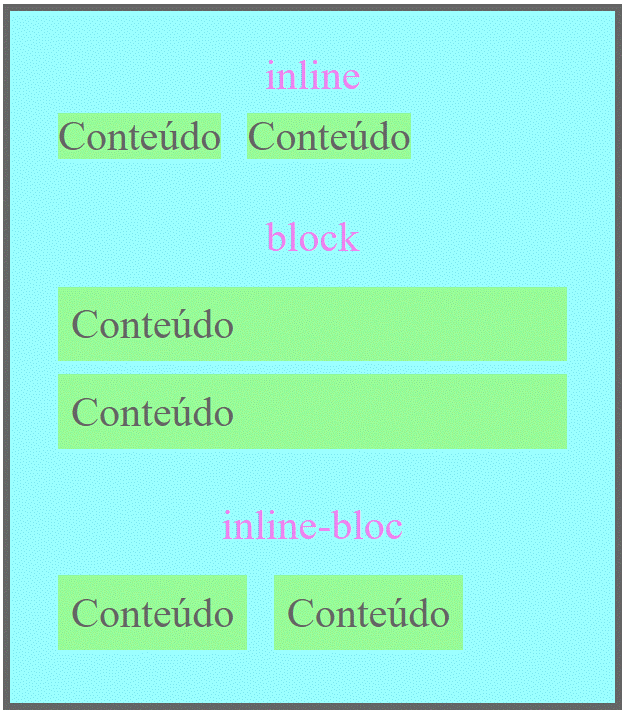
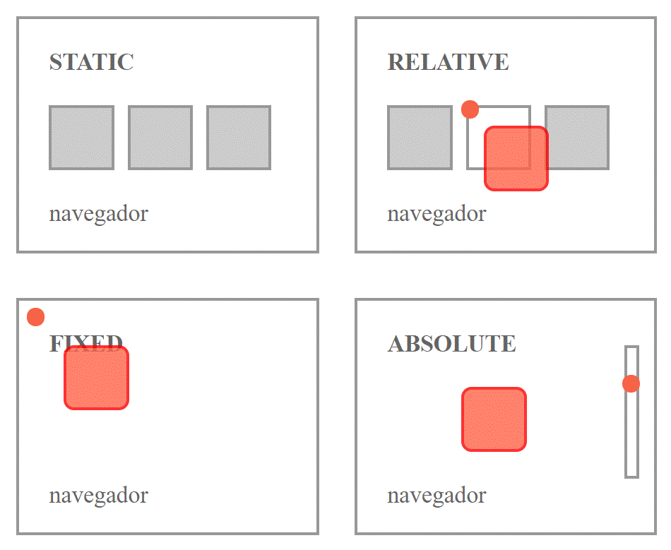

# display  (EXIBIÇÃO)



Configura como o elemento deve ser mostrado
* `block` - bloco (há quebra de linha para cada elemento)
* `inline` - na mesma linha  (não é possível determinar altura e largura, padding/margin vertical não são respeitados)
* `none` - não mostrar
* `inline-block` - na mesma linha, é possível determinar largura e altura, além de ter padding/margin respeitados.

Cada elemento tem um padrão, sendo o mais comum 'block'.

<br/>

## Block Elements

Começam em uma nova linha e ocupam a largura total.

* `<div>`
* `<h1> - <h6>`
* `<p>`
* `<form>`
* `<header>`
* `<footer>`
* `<section>`

É possível determinar uma largura para o elemento, que não ocupara mais a largura total.  
Para `<div>` é interessante determinar a largura maxíma, assim em telas pequenas não aparecerá barra de rolagem. 

## Inline Elements

Começam na mesma linha e ocupam apenas a largura necessária.

* `<span>`
* `<a>`
* ``

## Esconder um Elemento

Há duas possibilidades `display:none` e `visibility:hidden` a primeira desconsidera o elemento totalmente enquanto a segunda apenas esconde o elemento mas o espaço ocupado por ele permanece.

# position (POSICIONAMENTO)



Determinar a posição (por top, bottom, left, right), só funciona depois que determinar o tipo de posicionamento e funcionará de maneira diferente a depender do tipo de posicionamento.

**Valores possíveis:**
* `static` - por conta browser. (não é possível determinar top, ...)
* `relative` - posição normal, quando determinado top, ... o próximo elemento não ira para próxima linha.
* `fixed` - fixo na tela visível, usar o top, ... para posicionar.
* `absolute` - posicionado (top, ...) em relação ao elemento em que está contido. Se o elemento em que está contido não tem `position` ou tem `position: static;` o elemento será posicionado em relação ao `body`.
* `sticky` - posicionado **relative** até que uma determinada posição de deslocamento seja encontrada na janela de exibição, então, ele passa ser **fixed** (como a posição: fixa).
    ```css
        div {
        position: -webkit-sticky; /* Necessário para o Safari, no Explore não funciona */
        position: sticky;
        top: 0; /*quando elemento aparecer na posição top 0 permanecerá fixo */
    ```

Alguns posicionamento podem implicar em sobreposição, então é possível ordenar a posição no eixo Oz através da propriedade `z-index: -1;` atributo a cada elemento valores positivos ou negativos. Sem determinar a posição em z a ordem de sobreposição é dado pelo elemento último elemento no html.

# float (TRANSCENDER)

Determina que um elemento deve ser retirado do seu fluxo normal e colocado ao longo do lado direito ou esquerdo do seu containêr, elementos em linhas irão se posicionar ao seu redor.
Exemplo: posicionar uma imagem ao lada de um texto.

**Valores Possíveis:**
* `left` - a esquerda da caixa.
* `right` - a direita da caixa.
* `none` - na posição onde foi inserida, Padrão.
* `inherit` - herdar o valor do elemento superior.

Caso o elemento flutuante seja maior que a caixa do element ao qual ele fluta usar `overflow: auto;` para que ele não ultrapasse a caixa.

# clear (AFINIDADE)

Determinar se pode haver elementos flutuantes ao seu lado.

**Valores possíveis:**
* `none` - pode ter elemento flutuantes, padrão.
* `left` - não pode a esquerda.
* `right`- não pode a direita.
* `both` - não pode em nenhum dos lados.
* `inherit` - herdar valor do elemento superior.

# GRID LAYOUT

  

**Para definir um elemento e seu filhos com layout grid basta definir o display como `grid` ou `inline-grid`.**  
É de bom tom definir grid-template-column, quantas colunas vai possuir a grade.

## Espaçamentos

### >> Gap
```css
.entre-linhas {
    grid-row-gap: 50px;
}.entre-celulas {
    grid-gap: 50px 50px;    /* poderia colocar uma só vez. */
}/* 'grid-' pode ser omitido*/
```

### >> Column e Rows
```css
.itens-a {
    grid-auto-rows: 50px; /* largura das linhas. */
    grid-template-columns: 80px 200px auto 40px; /* quantas colunas e de que tamanhos. */
}
.itens-b { 
    grid-template: 150px / auto auto auto; /* Linha / colunas / areas(nomeadas) */
}
```

## Posições  

### >> Elemento da grade
```css
/* DEFINIR LARGURA DA COLUNA */
.item1 {
    grid-column: 1 / span 3; /* A partir da um expanda-se por 3 linhas. */
}

/* DEFINIR DIMENSÕES DA CÉLULA */
.item2{
    grid-area: 2 / 1 / 2 / 3; /* li ci lf cf */
}
```

### >> Alinhamento
```css
.container {
    justify-content: center; /* Como as celulas vão se posicionar horizontalmente. */
    align-content: center; /* Como as celulas vão se posicionar verticalmente. */
}
```

### >> Área nomeada
```css
.item1 { grid-area: header; }
.item2 { grid-area: menu; }
.item3 { grid-area: main; }
.item4 { grid-area: right; }
.item5 { grid-area: footer; }

.grid-container {
grid-template-areas:
    'header header header header header header'
    'menu main main main right right'
    'menu footer footer footer footer footer'
    'header . . . . .'; 
    /* A ultima linha possui uma celula header na primeira coluna. */
}
```

# FLEXBOX LAYOUT

`display: flex;` - para definir o layout do container.

## Container
* `flex-direction` - como os itens serão empilhados.
* `flex-wrap` - se os intens pode quebrar para próxima linha.
* `flex-flow` - combo [-direction + -wrap].
* `justify-content` - alinhamento horizontal.
* `align-items` - alinhamento do conteúdo na vertical.
* `align-content` - alinhamento do item na vertical.

## Itens
* `order` - ordem de cada elemento, padrão é '0'.
* `flex-grow` - proporção de cada item, padrão é '0'.
* `flex-shrink` - como o item vai encolher, padrão é '1', se '0' não encolhe.
* `flex-basis` - comprimento inicial.
* `flex` - combo [-grow -shrink -basis]
* `align-self` - alinhamento do item, sobrepõem o alinhamento definido pelo container.