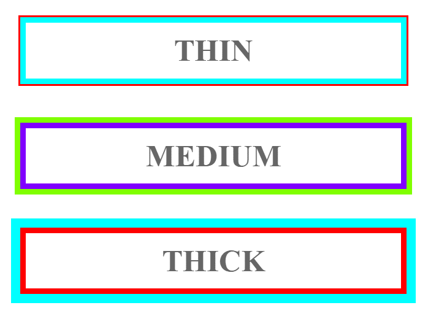

# Width e Height
- A largura e altura da área do conteúdo não inclui padding, border, margin.

- **'Valores possíveis'**
  - **'length'** - Tamanho determinado em px, cm etc.
  - **: auto** - Por conta do navegador.
  - **: x%** - Porcentagem da área onde está contido o elemento.
  - **: initial** - Valor padrão.
  - **: inherit** - Herdar do elemento que o contém.

- **'max e min'** 
  - **Max** - Determina até quanto a área do conteúdo pode aumentar, se o conteúdo demandar mais área que o determinado ele irar sobrepor a área do conteúdo.
  - **Min** - Reserva uma área minima para o conteúdo, ainda que ele não ocupe esta área.
  - **Importante** - Referisse apenas a área do conteúdo.
  - **'Propriedades'**
    * max-height
    * max-width
    * min-height &nbsp; &nbsp; `min-height: 200px;`
    * min-width  
  - **'Valores possíveis'**  
    * 'length' ou 'x%' ou 'none'(este é o padrão).

# overflow (EXCEDENTE)

Só funciona em elementos com altura definida.

**Valores possíveis:**
* `visible` - Padrão, o conteúdo transborda para fora da caixa do elemento.
* `hidden` - O conteúdo excedente é omitido.
* `scroll` - O conteúdo excedente é omitido, mas é adicionado um barra de rolagem para que haja acesso ao conteúdo.
* `auto` - Similar ao **scroll**, mas a barra só é adicionada se necessária.

`overflow-x` e `overflow-y` determinam como o conteúdo irá transbordar.
  
# Background

- **'Propriedade conjugada'**  
`background: #ffffff url("img_tree.png") no-repeat 10px 80px;`
  * background-color  
  * background-image  
  * background-repeat  
  * background-attachment  
  * background-position  
  
- **-color**
- **-imagem** &nbsp; &nbsp;        : url("paper.gif");
- **-repeat** &nbsp; &nbsp; &nbsp; : no-repeat;  
  > Defini como a imagem vai cobrir a área de fundo, para que ela se repita em horizontalmente temos 'repeat-x'.
- **-position**
- **-attachment** &nbsp; &nbsp;     : fixed;  
  > Para deixar a imagem fixa na tela. Também há "scroll" para que a imagem seja rolada.`

# Padding 

- **'Propriedade conjugada'**  
`padding: inherit auto 100px;`
  * padding-top
  * padding-right
  * padding-bottom
  * padding-left  
  
- **'Valores possíveis'**
  - **'length'** - specifies a margin in px, pt, cm, etc.
  - **: inherit** - Herdar do elemento que o contém.
  - **: X %** - Uma porcentagem do espaço onde está contido.
  - **'Tip'** - É possível colocar valores negativos.
  
- **'Colapso de margens'**  
  >Se o conteúdo tiver uma área definida adicionar um padding irá alterar essa área, para que isso não aconteça basta adicionar a sentença box-sizing: border-box;'.

# Border

- **'Propriedade conjugada'**  
`border: 5px solid red;`
  *  border-width
  *  border-style (requerido)
  *  border-color
  
- **-style**  
  `border-style: dotted dashed solid double;`  

    

- **-width**  
  - **: thin** (typically 1px)
  - **: medium** (typically 3px)
  - **: thick** (typically 5px)
  - **'Determinado'** (in px, pt, cm, em, etc)
- **-color**
- **'Especificar'**  
  `border-top-style: dotted;`  
  `border-right: 10px solid green;`
- **-radius**  
  `border-radius: 5px;`

# Outline

* Trata-se do contorno da borda, sobrepõem o que esta além da borda, não compõem a área total do conteúdo.

- **'Propriedade conjugada'**  
`outline: 5px solid red;`
  * outline-width
  * outline-style (requerido)
  * outline-color

- **-style**  
  `outline-style: dotted dashed solid double;`  
> Tem os mesmos valores que a borda.
- **-width**  
  `outline-width: thin;`

    

- **-color**  
  `outline-color: invert;` 
  > Para ficar visível independentemente 

- **-offset**
  > Deslocamento, espaço entre borda e contorno, esse espaço é transparente.

# Margin

- **'Propriedade conjugada'**  
`margin: inherit auto 100px;`
  * margin-top
  * margin-right
  * margin-bottom
  * margin-left  
  
- **'Valores possíveis'**
  * **'length'** - specifies a margin in px, pt, cm, etc.
  * **: auto** - Centralizar horizontalmente.
  * **: inherit** - Herdar do elemento que o contém.
  * **: X %** - Uma porcentagem do espaço onde está contido.
  * **'Tip'** - É possível colocar valores negativos.

- **'Colapso de margens'**  
  > Ocorre apenas com margens verticais, quando um elemento 'em cima' tem 'margin-bottom: x' possui um elemento 'em baixo' com 'margin-top: y' a margem entre os dois elemento vai colapsar na maior margem entre os dois, isto é, a margem vai ser 'y' ou 'x', mas não 'x+y'.`